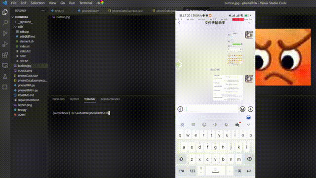

<div align="center"><h1>
<br/>
🔨 
<br />
rpa-tool
<br /><br />
</h1>
<sup>
<br />
<br />
<a href="none"></a><a href=https://space.bilibili.com/286773126></a>
<a href="none">   </a>
<a href="none">   </a>
<br />
</a>
<br />
用于window和anroid系统上的rpa工具类实例
</sup>
</div>


## Description

支持识图点击，滑动，输入，按键操作等常规操作

一个rpa常用方法的集成库 ，目前支持两个平台

- window
- android


然后 有两种调用方式，

- 通过python直接调用
- 通过exe加上命令参数调用

具体可以参考

[PC端文档](./pcRPA/README.md)

[移动端文档](./phoneRPA/README.md)


##  Quickstart

clone 仓库或者 从 https://github.com/electroluxcode/rpa-tool/releases 下载 exe文件(注意如果要运行手机端rpa需要在远端控制设备上安装adb)


## Example


手机识图示例, 具体的参数可以参考 phoneRPA\phoneDataExample.json  这个json的文件，参数可能有一些变化




pc端识图参数可以参考 pcRPA\pcDataExample.json  这个json的文件，参数可能有一些变化


如果是想运行json数据，那么参考 example.json的数据，然后运行 pcRPA.py 和 phoneRPA.py 就可以了

如果是想运行exe 和 cli.py, 使用示例如下 

```js
const { exec } = require('child_process');

const data =  [
  {
    "cmdType": "Click",
    "cmdParam": {
        "x": 100,
        "y": 100,
        "clicks": 2
    }
},
]

  const normalJsonStr = JSON.stringify(data)
  const escapedJsonStr = (normalJsonStr).replaceAll("\"", "\\\"").replaceAll("\\\\", "\\")
  console.log("'" +escapedJsonStr+ "'");
  
  exec('pcRPAToolCli.exe ' + escapedJsonStr, (error, stdout, stderr) => {
    if (error) {
      console.error(`执行的错误: ${error}`);
      return;
    }
    console.log(`标准输出: ${stdout}`);
    if (stderr) {
      console.error(`标准错误输出: ${stderr}`);
    }
  });


```


## Struct

```js
tree /f > list.txt 生成

│  README.md // 总的readme
│  
├─pcRPA  // pc端 的  RPA
│      pcData.json // 你的逻辑写在这里
│      pcDataExample.json  // 所有示例的传参
│      pcRPA.py   // RPA主文件   python pcRPA.py
│      README.md // pc端 的 readme
│      requirements.txt // 依赖文件
│      test.py // 我的测试文件
│      
└─phoneRPA // 手机端的  RPA
    │  button.jpg 
    │  output.png
    │  phoneData.json // 你的逻辑写在这里
    │  phoneDataExample.json // 所有示例的传参
    │  phoneRPA.py // RPA主文件   python phoneRPA.py
    │  phoneRPAFn.py // 本来想模块化的，结果发现虚拟环境(conda)和用exe真实环境的模块有出入，因此删掉了这个文件
    │  README.md // 移动端 的 readme
    │  requirements.txt  // 依赖文件
    │  screen.png // 这就是你 手机上面的 截图 
    │  test.py // 我的测试文件
    │  ui.xml // ui的 xml 文件 也是 通过 adb 得到的 。 用来查找UI的属性 进行点击
    │  
    ├─adb
    │      adb.zip  // 这玩意解压后 添加环境变量就好了
    │      adb说明.md
    │      element.sh
    │      index.sh
    │      index.txt
    │      ls.txt
    │      test.txt
    │      
    
            

```


## Developer

```js
如果你想添加你自己的东西
--1.在pcRPA.py 和 phoneRPA.py 中 的 mainWork中 添加事件
--2.为了程序的可读性，可以在pcDataExample.json和 phoneDataExample.json中添加你的示例
--3.只要在 pcData.json 和 phoneData.json 中 添加 你的参数 然后 python 你的文件.py就可以运行
```


## Badge

[](https://gitee.com/Electrolux)

```
[](https://gitee.com/Electrolux)
```


## Support

frontEngineerPlugin is developed by me. Please use frontEngineerPlugin, star it on gitee or even become a [sponsor](https://gitee.com/Electrolux) to support us!


## update