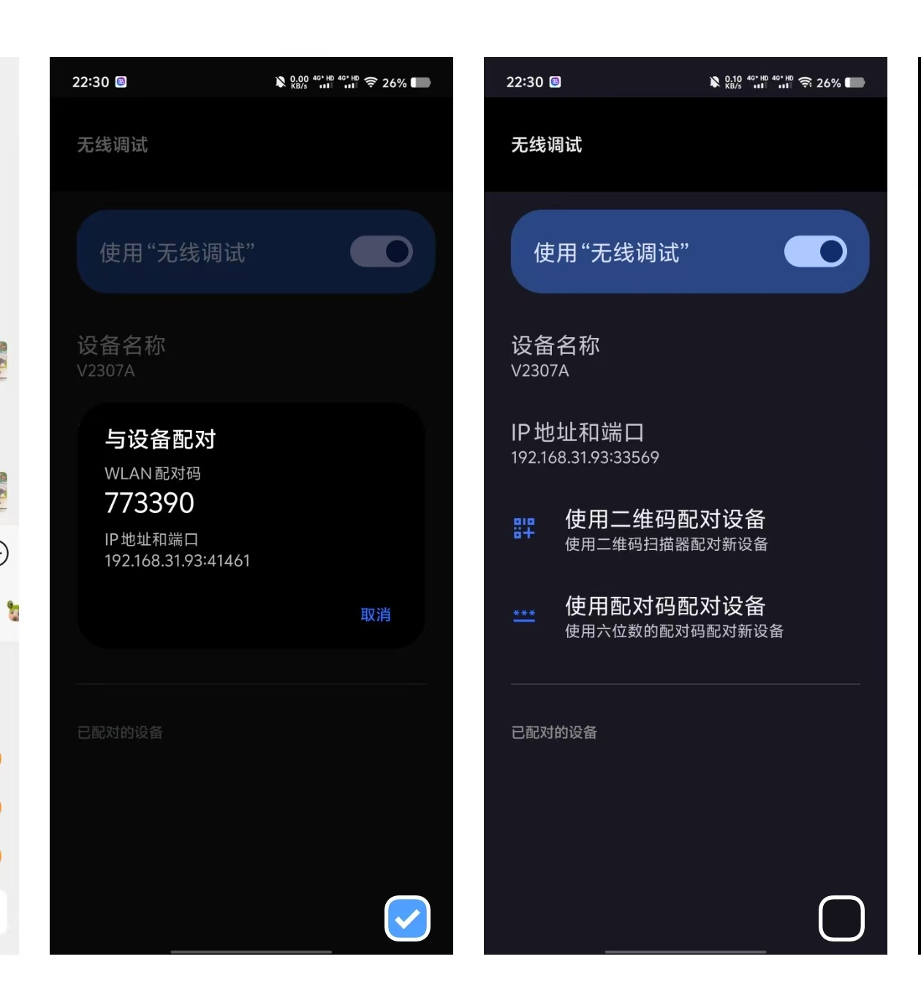

# phoneRPA


## 说明

参数说明和参数使用方法参考可以参照 `phoneDataExample.json` ，都是语义化的东西

核心是两个文件

- phoneRPA.py 用来执行json中的代码，默认读取 phoneData.json 中的代码 
- RPAToolCli.py 用来执行命令行的代码，以供其他语言直接调用，以下是调用实例
- RPAToolCli.exe 在released中，功能和RPAToolCli.py 相同，打包是为了方便使用


## 打包
pip install pyinstaller  -i http://mirrors.aliyun.com/pypi/simple --trusted-host mirrors.aliyun.com
pyinstaller -F -w   phoneRPAToolCli.py


## 开发

### 1.1有线连接
```js
--1. 手机上开发者选项和USB调试 模拟点击打开
--2. 这个文件夹下面的adb/adb.zip 解压后，添加这个环境到环境变量
--3. 有线连上后
--3.1 adb devices // 输出现在连接的设备，有限连接后 才有设备。这个时候 会输出 xxxxxx（反正不是空值）
--3.2 手机上设置中状态信息 找到手机ipv4的地址
--3.3 adb tcpip 6666 //电脑端开启新的端口，这个时候可以拔掉有线连接
--3.4 adb connect 172.18.88.216:6666 //（手机网段 在步骤3.2 找到的）
--3.5 这时候就可以开始了
```


### 1.2无线连接

android 10以上可以用，10以下没有

- 1. 开发者选项打开无线连接
- 2. 选择用 用配对码配对设备



- 3. 电脑端使用  adb pair 192.168.31.93:41461 并且输入激活码配对


